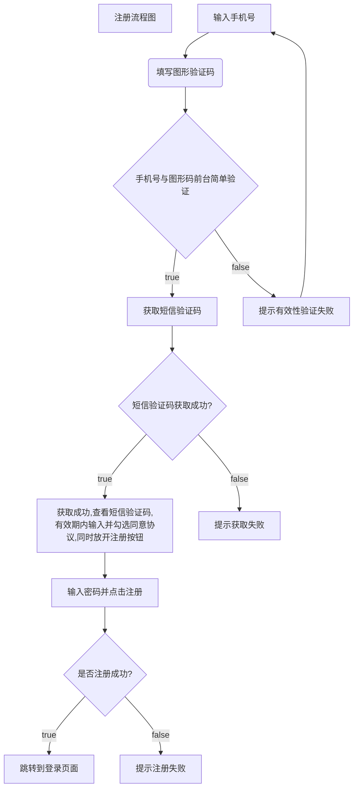

TIPS:
开发模式下，注册和忘记密码时发送短信验证码可以在[该页面](http://localhost:8080/estore/member_watch_sms_captcha.action)中查看

```mermaid
graph TD
A[注册流程图]
B[输入手机号] 
B-->C(填写图形验证码)
C-->D{手机号与图形码前台简单验证}
D-->|true| E[获取短信验证码]
D-->|false| F[提示有效性验证失败]
F-->B
E-->G{短信验证码获取成功?}
G-->|true| H[获取成功,查看短信验证码,有效期内输入并勾选同意协议,同时放开注册按钮]
G-->|false| I[提示获取失败]
H-->J[输入密码并点击注册]
J-->K{是否注册成功?}
K-->|true| L[跳转到登录页面]
K-->|false| M[提示注册失败]
```